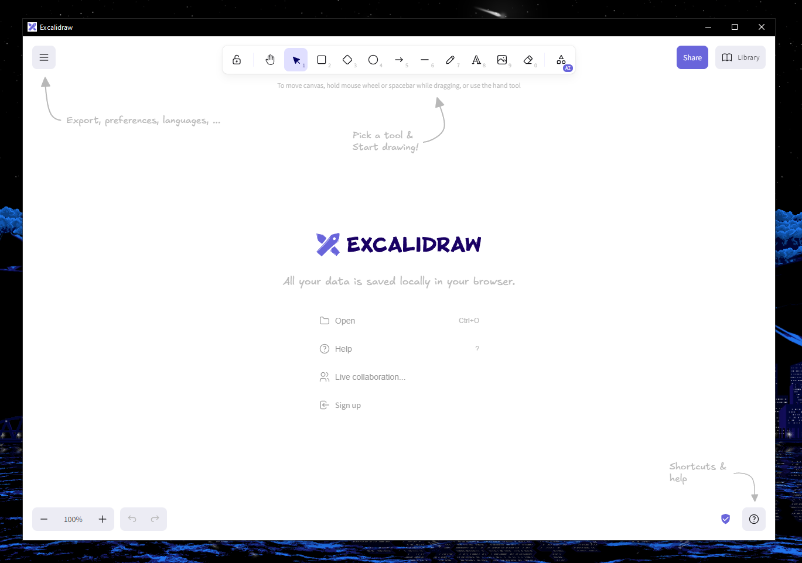

# excalidraw-desktop

<!-- hy-mt2-i18n:start -->
[English](./README.md) | [中文](./README_zh-CN.md) | [日本語](./README_ja.md) | **Español**
<!-- hy-mt2-i18n:end -->

Cliente de escritorio no oficial para Excalidraw en Windows, macOS y Linux. Se trata simplemente de un envoltorio de Electron para el sitio web; lo creé porque no quería usarlo dentro de una pestaña.

> **Nota:** Esto carga el sitio web en vivo [excalidraw.com](https://excalidraw.com); se necesita una conexión a Internet para el primer inicio. Las siguientes veces que se inicie, es posible que funcione sin conexión gracias al caché del navegador.



## Instalación
Visite la página [Releases](https://github.com/pgkt04/excalidraw-desktop/releases/) y descargue el instalador adecuado para su sistema operativo:

| Plataforma | Formato |
|----------|--------|
| macOS | `.dmg` (Apple Silicon) |
| Windows | Setup `.exe` o Portable `.exe` |
| Linux | `.AppImage` o `.deb` |

### macOS
Si recibe el error “Está dañado y no se puede abrir. Debería moverlo a la papelera”, ejecute:
```bash
xattr -c /Applications/Excalidraw.app
```
Esto ocurre porque no dispongo de un certificado de desarrollador y el archivo no está notariado.

### Linux (AppImage)
Después de descargarlo, haga ejecutable el AppImage:
```bash
chmod +x Excalidraw-*.AppImage
./Excalidraw-*.AppImage
```

## Asociación de archivos
La aplicación se registra como procesadora de archivos `.excalidraw`. Puede hacer doble clic en cualquier archivo `.excalidraw` para abrirlo directamente en la aplicación. En Windows (instalador NSIS), se le pedirá confirmación durante la instalación; en macOS y Linux, es automático.

## Desarrollo
Antes de compilar el proyecto, asegúrese de tener instalados los siguientes requisitos previos:

- Node.js (versión 22.12.0 o superior)
- npm (viene incluido con Node.js)

Clone el repositorio:
```bash
git clone https://github.com/pgkt04/excalidraw-desktop.git
cd excalidraw-desktop
```

Instale las dependencias:
```bash
npm install
```

### Ejecución
Para ejecutar la aplicación en modo de desarrollo:
```bash
npm start
```

### Compilación
Para crear una versión lista para producción:

| Comando | Plataforma | Salida |
|---------|----------|--------|
| `npm run dist` | Sistema operativo actual | Depende de la plataforma |
| `npm run dist:mac` | macOS | `.dmg` (arm64) |
| `npm run dist:win` | Windows | Portable `.exe` + NSIS Setup `.exe` |
| `npm run dist:linux` | Linux | `.AppImage` + `.deb` |

Los instaladores generados estarán en la carpeta `dist/`.
